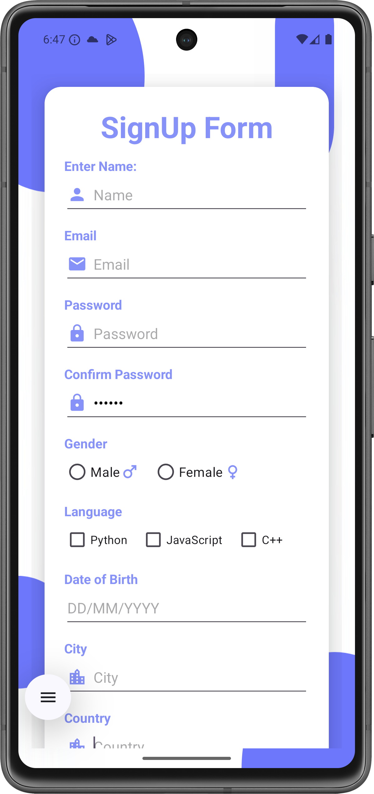
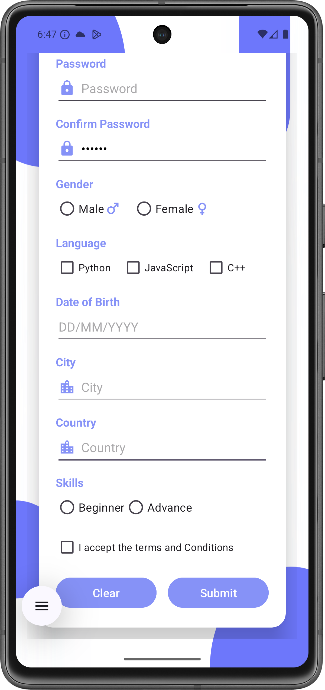

# Android Custom Sign-Up Form

A fully-functional sign-up form for an Android application, built as a university assignment. This project features a custom-styled UI, form validation, and a date picker.

## Screenshot

   
   

## Features
* **Custom UI:** A modern, clean UI built with a `CardView` and custom background.
* **Form Validation:**
    * Checks if "Password" and "Confirm Password" match.
    * Checks if "Terms and Conditions" are accepted.
* **Data Summary:** Displays a `Toast` (or `AlertDialog`) with all the user's information upon successful sign-up.
* **Date Picker:** Uses a native `DatePickerDialog` for "Date of Birth" input.
* **Clear Form:** A "Clear" button to reset all fields.

## Technologies Used
* **Kotlin**
* **Android SDK**
* **View Binding:** For safely accessing UI elements.
* **XML** for layouts (featuring `CardView`, `ScrollView`, and `LinearLayout`).
